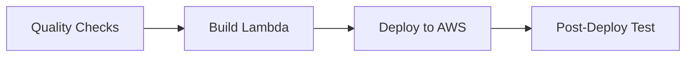

# CI/CD Pipeline Documentation

## Overview

This project includes a comprehensive GitHub Actions CI/CD pipeline that automates testing, building, deployment, and verification of the Rust Lambda function. The pipeline ensures code quality, security, and reliable deployments to AWS Lambda.

## Pipeline Architecture

The CI/CD pipeline consists of four main jobs that run sequentially:



### Job Details

1. **Quality Checks** - Runs on all pushes and PRs

   - Unit tests (`cargo test`)
   - Code linting (`cargo clippy`)
   - Format checking (`cargo fmt --check`)
   - Security audit (`cargo audit`)

2. **Build Lambda** - Runs only on main/develop branch pushes

   - Cross-compilation for AWS Lambda
   - Artifact packaging and storage

3. **Deploy to AWS** - Runs after successful build

   - AWS Lambda function deployment
   - Environment variable configuration
   - Branch-based environment selection

4. **Post-Deploy Test** - Runs after successful deployment
   - Lambda function invocation with test payload
   - Response validation
   - CloudWatch logs retrieval

## Required GitHub Configuration

This pipeline uses **AWS OpenID Connect (OIDC)** for secure authentication without long-lived access keys.

### AWS OIDC Setup (Required)

The pipeline assumes an AWS IAM role using OIDC. The role ARN is configured in the workflow:

```
arn:aws:iam::379673441375:role/github-actions-role
```

**No AWS access keys or secrets are required** - authentication is handled automatically through OIDC.

### GitHub Variables (Optional - uses defaults if not set)

Configure these in your GitHub repository settings → Settings → Secrets and variables → Actions → Variables:

```
AWS_REGION                   # AWS region (default: eu-west-2)
LAMBDA_FUNCTION_NAME_PROD    # Production function name (default: gov-data-prod)
LAMBDA_FUNCTION_NAME_STAGING # Staging function name (default: gov-data-staging)
S3_BUCKET_PROD              # Production S3 bucket (default: gov-data-lucky4some.com)
S3_BUCKET_STAGING           # Staging S3 bucket (default: gov-data-staging-lucky4some.com)
```

## AWS IAM Role Configuration

The GitHub Actions workflow assumes the IAM role `arn:aws:iam::379673441375:role/github-actions-role` using OIDC.

### Required IAM Role Permissions

The assumed IAM role needs the following minimum permissions:

```json
{
  "Version": "2012-10-17",
  "Statement": [
    {
      "Effect": "Allow",
      "Action": [
        "lambda:CreateFunction",
        "lambda:UpdateFunctionCode",
        "lambda:UpdateFunctionConfiguration",
        "lambda:InvokeFunction",
        "lambda:GetFunction",
        "lambda:TagResource",
        "iam:CreateRole",
        "iam:AttachRolePolicy",
        "iam:PassRole",
        "iam:GetRole",
        "logs:DescribeLogGroups",
        "logs:FilterLogEvents",
        "logs:CreateLogGroup"
      ],
      "Resource": "*"
    }
  ]
}
```

### OIDC Trust Policy

The IAM role must have a trust policy that allows GitHub Actions to assume it:

```json
{
  "Version": "2012-10-17",
  "Statement": [
    {
      "Effect": "Allow",
      "Principal": {
        "Federated": "arn:aws:iam::379673441375:oidc-provider/token.actions.githubusercontent.com"
      },
      "Action": "sts:AssumeRoleWithWebIdentity",
      "Condition": {
        "StringEquals": {
          "token.actions.githubusercontent.com:aud": "sts.amazonaws.com"
        },
        "StringLike": {
          "token.actions.githubusercontent.com:sub": "repo:your-org/your-repo:*"
        }
      }
    }
  ]
}
```

````

## Branch-Based Deployment Strategy

| Branch      | Environment | Lambda Function    | S3 Bucket                         | Concurrency |
| ----------- | ----------- | ------------------ | --------------------------------- | ----------- |
| `main`      | Production  | `gov-data-prod`    | `gov-data-lucky4some.com`         | 20          |
| `development` | Staging     | `gov-data-staging` | `gov-data-staging-lucky4some.com` | 10          |
| `feature/*` | None        | Tests only         | N/A                               | N/A         |

## Workflow Triggers

### Automatic Triggers

- **Push to `main`**: Full pipeline (test → build → deploy → verify)
- **Push to `development`**: Full pipeline to staging environment
- **Pull Request**: Quality checks only (no deployment)

### Manual Triggers

The workflow can be manually triggered from the GitHub Actions tab with custom parameters.

## Environment Variables Set by Pipeline

The pipeline automatically configures the following environment variables in the deployed Lambda function:

```yaml
BUCKET_NAME: # Environment-specific S3 bucket name
CKAN_API_BASE_URL: https://ckan.publishing.service.gov.uk/api/action
CONCURRENCY_LIMIT: # 20 for prod, 10 for staging
ENVIRONMENT: # "production" or "staging"
GIT_COMMIT: # Git commit SHA for tracking
````

## Pipeline Features

### 🚀 Performance Optimizations

- **Caching**: Cargo dependencies and build artifacts
- **Parallel Execution**: Quality checks run in parallel
- **Conditional Jobs**: Deployment only on specific branches

### 🔒 Security Features

- **Dependency Scanning**: `cargo audit` for vulnerabilities
- **Secret Management**: AWS credentials stored as GitHub secrets
- **Minimal Permissions**: IAM roles with least privilege

### 🧪 Testing & Quality

- **Unit Tests**: All tests must pass before deployment
- **Code Quality**: Clippy linting and format checking
- **Post-Deploy Verification**: Live Lambda function testing

### 📊 Monitoring & Observability

- **Detailed Logging**: Each step provides comprehensive output
- **CloudWatch Integration**: Automatic log retrieval after deployment
- **Deployment Tracking**: Git commit SHA tracking in Lambda

## Usage Examples

### Setting Up the Pipeline

1. **Verify AWS OIDC Configuration**:

   - Ensure the IAM role `arn:aws:iam::379673441375:role/github-actions-role` exists
   - Verify the role has the required permissions (see IAM Role Configuration above)
   - Confirm the OIDC trust policy allows your GitHub repository

2. **Configure GitHub Variables** (optional - uses defaults if not set):

   ```bash
   # In your GitHub repository settings → Secrets and variables → Actions → Variables
   AWS_REGION: eu-west-2
   LAMBDA_FUNCTION_NAME_PROD: your-prod-function-name
   LAMBDA_FUNCTION_NAME_STAGING: your-staging-function-name
   S3_BUCKET_PROD: your-prod-bucket-name
   S3_BUCKET_STAGING: your-staging-bucket-name
   ```

3. **Create S3 Buckets** (if using custom names):

   ```bash
   aws s3 mb s3://your-prod-bucket-name --region eu-west-2
   aws s3 mb s3://your-staging-bucket-name --region eu-west-2
   ```

4. **Push to trigger deployment**:
   ```bash
   git push origin main     # Deploys to production
   git push origin development  # Deploys to staging
   ```

### Local Testing Before Push

Test your changes locally before pushing:

```bash
# Run the same quality checks locally
cargo test
cargo clippy --all-targets --all-features -- -D warnings
cargo fmt --all -- --check
cargo audit

# Test Lambda function locally
cargo lambda build
cargo lambda watch &
cargo lambda invoke --data-file data.json
```

## Troubleshooting

### Common Issues

**Build Failures**:

- Check Rust compilation errors in the build job logs
- Verify all dependencies are properly specified in `Cargo.toml`
- Ensure cross-compilation compatibility

**Deployment Failures**:

- Verify AWS credentials are correctly configured
- Check IAM permissions match the required policy
- Ensure Lambda function names don't conflict

**Test Failures**:

- Check Lambda function logs in CloudWatch
- Verify S3 bucket exists and is accessible
- Ensure CKAN API is reachable from Lambda

### Debugging Steps

1. **Check GitHub Actions logs** for detailed error messages
2. **Review AWS CloudWatch logs** for Lambda execution details
3. **Verify AWS resources** exist and have correct permissions
4. **Test locally** using `cargo lambda` commands

### Getting Help

- Check the [GitHub Actions documentation](https://docs.github.com/en/actions)
- Review [Cargo Lambda documentation](https://www.cargo-lambda.info/)
- Examine AWS Lambda and CloudWatch logs for runtime issues

## Pipeline Maintenance

### Regular Updates

- Update Rust toolchain versions in workflow
- Keep GitHub Actions versions current
- Review and update security audit findings

### Monitoring

- Monitor deployment success rates
- Track pipeline execution times
- Review security scan results regularly

### Scaling

- Adjust concurrency limits based on usage
- Consider multiple AWS regions for global deployment
- Implement blue-green deployment strategies for zero-downtime updates

This CI/CD pipeline provides a robust, secure, and efficient deployment process for the Rust Lambda application, ensuring high code quality and reliable deployments to AWS.
